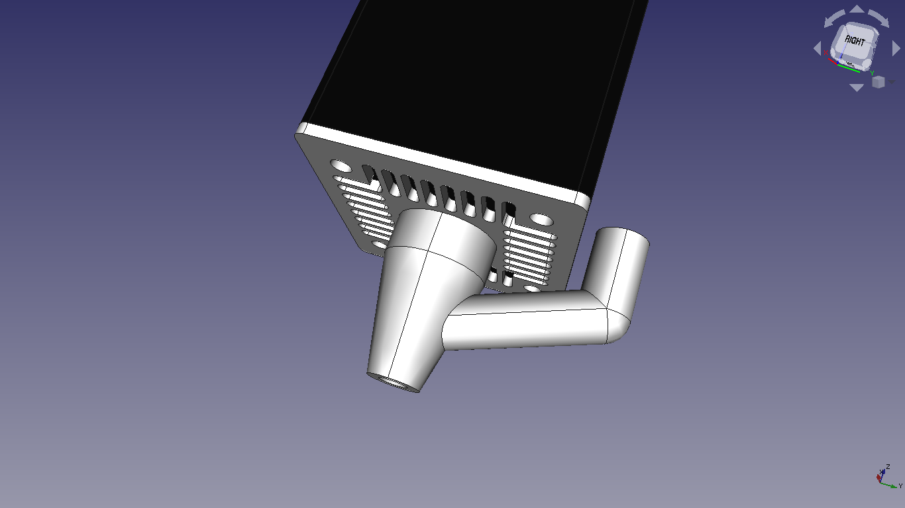
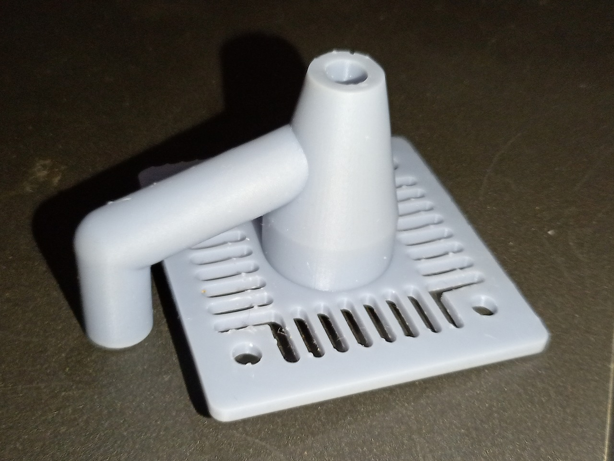
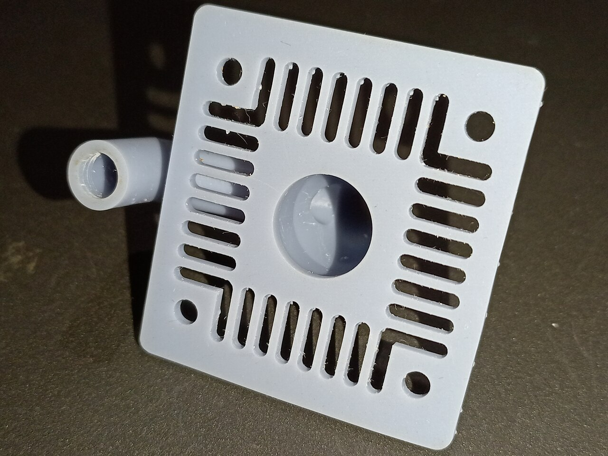
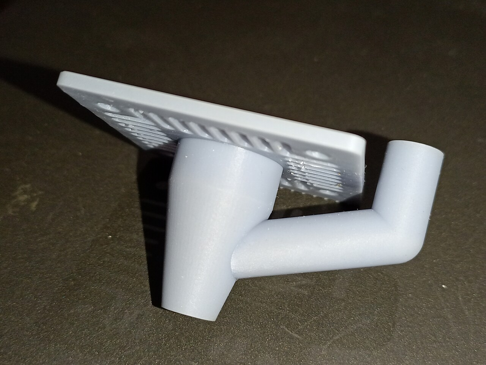

# Air-Assist nozzle

Air-Assist nozzle for unknown Chinese diode laser module.  
10W Output Power, without air-assist it's only worth engraving, due to high heat and smoke. 10% power engrave wood (not mark), so need some air for cooling path while cutting.  

### Dimensions

 - 6mm hole (for polyurethane air hose, optionally with quick connector)  
 - Outer dimensions: 47,5mm * 43mm  
 - Height: 35mm
 - Mounting holes center distance: 32mm  

This was designed in just a few minutes, so ventilation pads are not easily editable.  
For that reason there is another part without vent pads, so you can edit dimensions and draw your own ventilation pads.  

Printed on Mono 4K with Anycubic ECO gray resin.  

