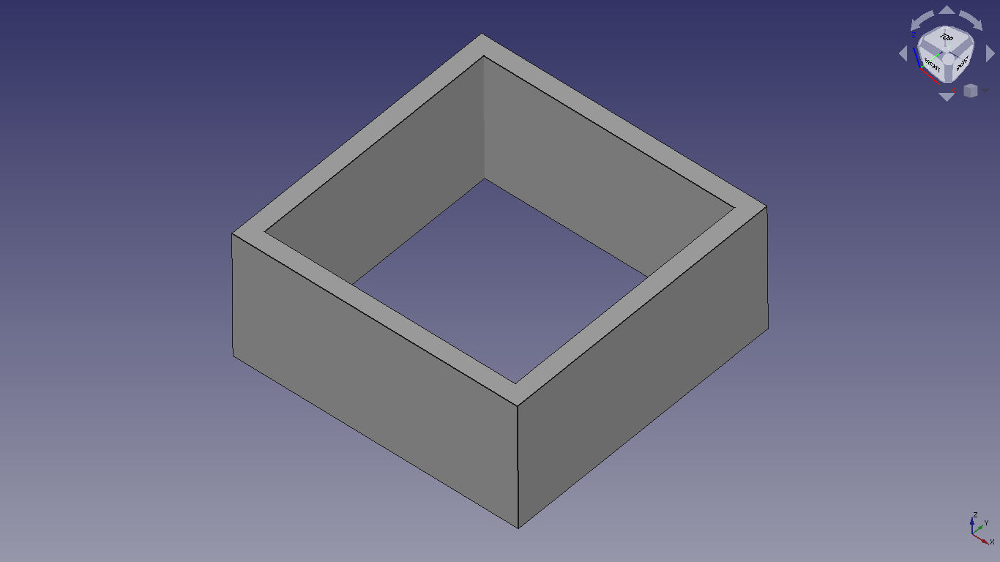

# Parametric Flow Test Cube

Measure extruder steps in free-air, then configure flow in slicer. This way it's easy to calibrate settings for each roll of filament, just with slicer changes.  

Open spreadsheet and edit test-cube parameters:  

 - cube length  - default `20 mm`,  
 - cube height  - default `15 x layer_height`,  
 - layer_width  - default `0.6 mm`,  
 - layer_height - default `0.3 mm`,  
